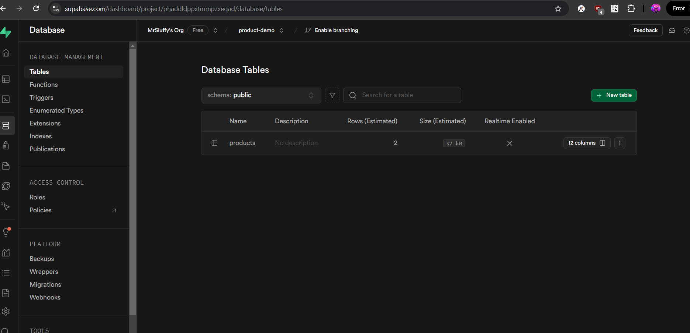
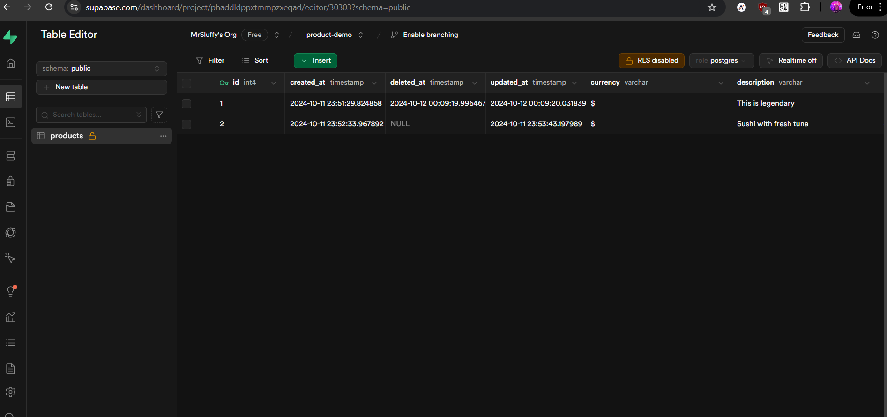
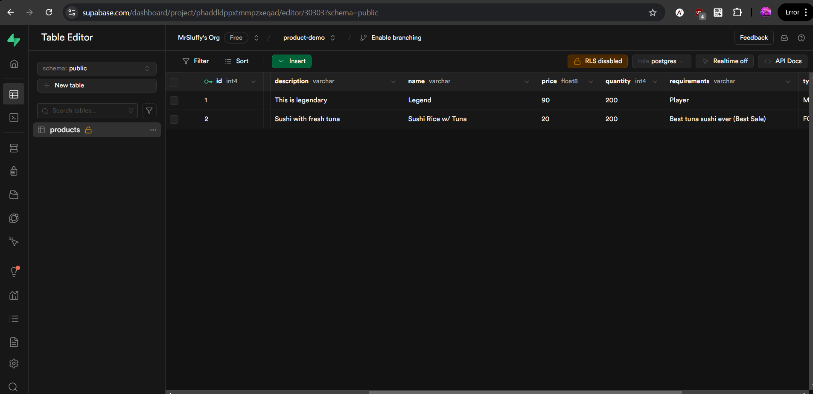
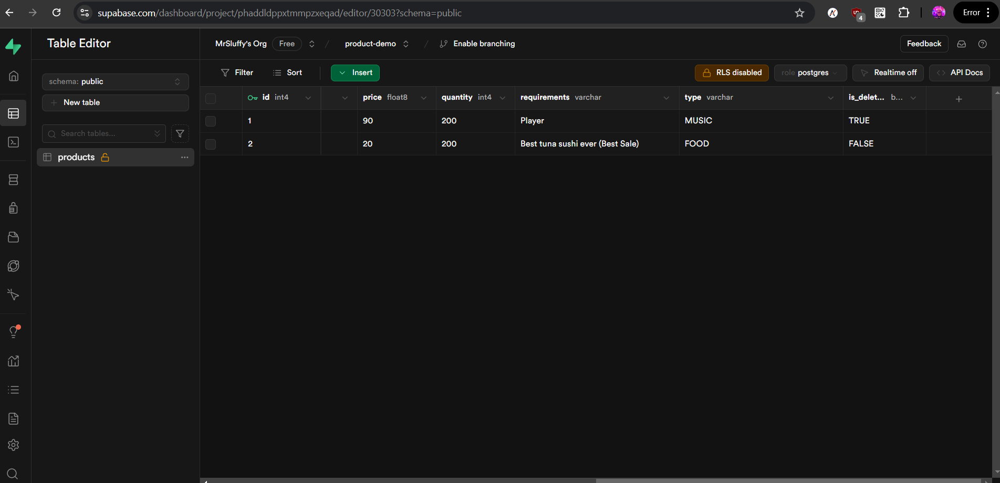
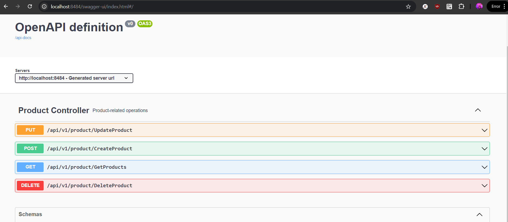
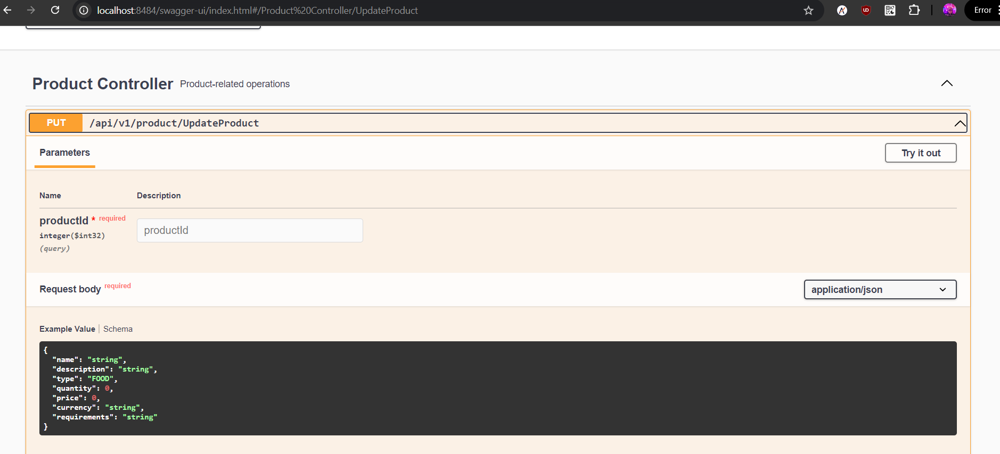
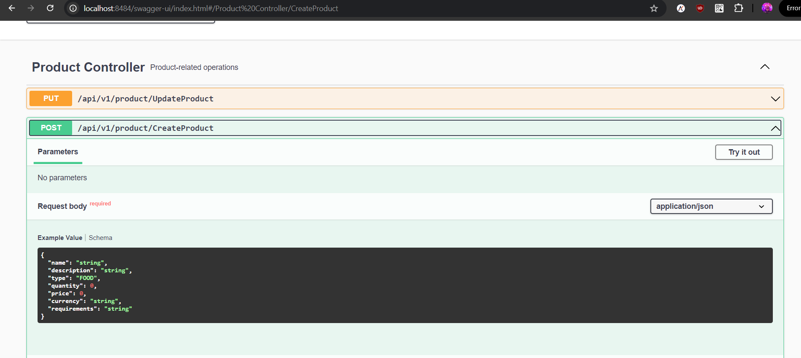
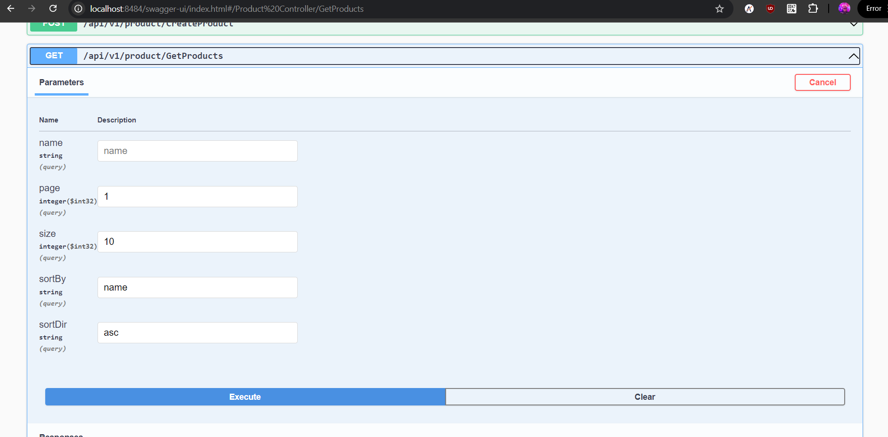
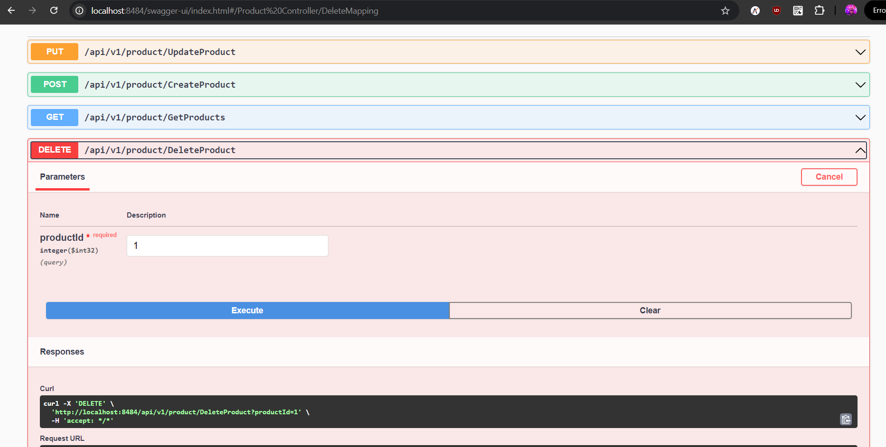

## Demonstration CRUD using Spring Boot

### Deployed on Render
- https://product-crud-demo.onrender.com/swagger-ui/index.html

## Profile :
| **Profile** | **Value**    |
|-------------|--------------|
| Production  | `production` |
| Staging     | `staging`    |
| Local       | `local`      |

To create a production build, call `mvn -B clean verify --file pom.xml package -P local` (Windows),
or `./mvnw -B clean verify --file pom.xml package -P local` (Mac & Linux).
This will build a JAR file with all the dependencies and front-end resources,
ready to be deployed. The file can be found in the `target` folder after the build completes.

Once the JAR file is built, you can run it using
`java -jar target/*.jar`

### Images

